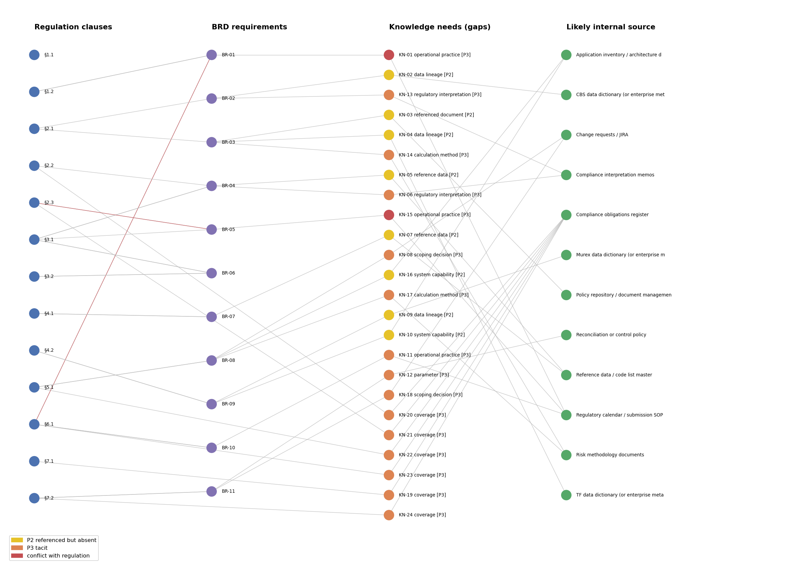

# regkg: finding the knowledge a BRD doesn't write down

Johann James, September 2026

This is a small prototype I put together while exploring one question: if you have a regulation and the BRD that was written from it, can you work out which parts of the BRD came from the regulation, and which parts came from somewhere else?

The "somewhere else" is the interesting part. When a business team writes a BRD for a regulatory report, they don't only read the regulation. They know which system holds the loan balances, how the bank has always grouped customers, what was agreed in a meeting two years ago. Some of that ends up in the BRD. A lot of it doesn't. I wanted to see whether a knowledge graph could point at those spots.



The picture reads left to right: regulation clauses, then BRD requirements, then the gaps the tool found, then the place it thinks each gap could be answered. Yellow gaps are things the BRD mentions but we don't have (a table, a policy document). Orange ones are numbers or decisions with no source at all. Red means the BRD actually disagrees with the regulation.

## Two ways to see it without running anything

- **[demo.ipynb](demo.ipynb)**: a step-by-step walkthrough with all the outputs already in it. GitHub shows it right in the browser.
- **[outputs/demo.html](outputs/demo.html)**: an interactive page. Download it and open it in any browser. Click a requirement to see its text highlighted by where each detail came from, its regulation-only twin, and every gap with a likely source and a question for an SME.

## The idea in one line

For every requirement in the BRD, I ask: *what would you need to know, on top of the regulation, to write exactly this sentence?* If the answer is in the regulation, fine. If the BRD explains it itself, fine. If neither does, that's a gap.

## What I did

**1. Wrote a test case.** I couldn't use a real BRD yet, so I wrote my own. `data/regulation.md` is a made-up large-exposures regulation with 13 clauses. `data/brd.md` is a BRD I wrote from it, with 11 requirements and a short glossary. While writing the BRD I deliberately slipped in 18 gaps (an undefined table here, an unexplained tolerance there, a deadline that quietly conflicts with the regulation) and listed them in `data/ground_truth.json` before running anything. That file is the answer key.

**2. Rules first, no LLM.** A regulation talks in concepts like "exposure" or "connected counterparties". A BRD can't stay that vague; it has to name tables, fields, systems, codes, numbers and documents. So the first step (`regkg/anchors.py`) just pulls those concrete details out of each requirement with pattern rules, things like `LN_ACCT_DAILY`, "Murex", "0.5 percent", "Credit Risk Policy v4.2, Annexure 3", or phrases like "where GROUP_ID is null" and "not considered in this release". Then it checks each one: is it in the regulation? Is it defined in the BRD glossary? If not, it's flagged.

A couple of small tricks helped. Acronyms get matched against the first letters of phrases in the regulation, so "CCF" correctly traces back to "credit conversion factors". And `regkg/coverage.py` compares requirements to clauses by word overlap (TF-IDF), which is how it noticed that nothing in the BRD covers the data lineage clause (§7.1).

**3. The LLM step.** Rules only see what's on the surface. They can't tell that "include accrued interest" is a judgement call, or that "the CAR return for the same quarter" quietly contradicts "the most recent return". For that I added an LLM step (`regkg/semantic.py`). For each requirement, the LLM gets the full regulation, the glossary and the requirement, and is asked to do three things in one go:

- say which clauses the requirement implements, and how: *entailed* (follows directly), *refines* (makes it more specific), *extends* (adds something new) or *contradicts*;
- rewrite the requirement using **only** the regulation, as if the writer knew nothing about the bank. I call this the "regulation-only twin";
- list every fact or decision needed to get from that twin to the real requirement, each with a type (data lineage, reference data, calculation method, interpretation, scoping decision and so on), where it's stated (regulation, BRD or nowhere) and a question you could ask an SME.

It returns JSON. There's also one extra call that goes clause by clause and asks whether the BRD covers each one fully, partly or not at all.

The twin was the part I liked most. For BR-05, the twin says "Tier 1 capital from the most recent capital adequacy return", which is what the regulation says. The real BRD says "from the CAR return for the same reporting quarter". Every single detail in BR-05 traces to a source, so the rules think it's clean. Only comparing the two versions shows the problem.

An honest note on this step: I didn't have an API key while building this, so I produced the LLM outputs myself by working through the same prompts by hand. They're saved in `data/llm_cache.json`, and the code reads them from there by default. If you set `ANTHROPIC_API_KEY` and run with `--llm anthropic`, the code sends the real prompts to the API and saves the answers next to the cache, but I haven't tried that live yet.

**4. Joining it all up.** `regkg/knowledge.py` merges what the rules and the LLM found, so the same gap isn't listed twice, and turns each one into a "knowledge need". It also gives each requirement a level:

- P0: everything traces to the regulation
- P1: the BRD explains the extra bits itself
- P2: it names something we don't have (a table, a system, a document), so someone just needs to go and fetch it
- P3: a number or decision with no source and no reason given, so someone has to be asked

Each gap is then pointed at the kind of place that usually holds that knowledge: data lineage goes to the named system's data dictionary, interpretations go to compliance memos or regulator FAQs, scoping decisions go to change requests and steering minutes, and so on. `regkg/graph.py` builds the graph with NetworkX and draws the picture above.

## What came out

| Planted gaps | Count | Rules only | Rules + LLM |
|---|---|---|---|
| Visible in the text | 13 | 13 | 13 |
| Only visible through meaning | 5 | 0 | 5 |
| Total | 18 | 13 | 18 |

The rules on their own found 13 of the 18 and didn't raise a single false alarm. The 5 they missed were exactly the "meaning" ones, which the LLM step picked up. It also flagged 2 real gaps I hadn't planted: there's no haircut treatment for cash collateral, and non-funded exposure never gets reconciled. Only 1 of the 11 requirements traced fully back to the regulation.

When you run it with the LLM step, precision shows as 75%. Those aren't wrong flags: 4 of the extras are the same gaps seen from the regulation's side, and 2 are the unplanted real ones above.

Here's one row from `outputs/gaps.csv`, to give a feel for the output:

> **BR-01**: The BRD says submit within T+12 business days. The regulation says 15 calendar days, and 12 business days can easily run past that. Suggested source: the regulatory calendar or submission SOP. Question for an SME: *Is T+12 business days meant as an internal buffer? Which deadline is binding?*

## Please don't over-read the numbers

I wrote the regulation, the BRD and the answer key, and I produced the LLM answers by hand, so none of this is an independent test. The rules at least don't know anything about the answer key, but I built them while looking at this one example, and a real BRD will definitely trip them up. What this shows is that the approach works end to end. How accurate it is on real documents is the next thing to find out.

## Running it

You need Python with two libraries:

```
pip install -r requirements.txt
```

Then, from this folder:

```
python run.py                  # rules + the saved LLM answers
python run.py --llm none       # rules only
python run.py --llm anthropic  # live LLM, needs ANTHROPIC_API_KEY
```

It prints a summary and writes everything to `outputs/`: `demo.html` (the interactive page), `gaps.csv` (every gap with its evidence, type, likely source and SME question), `requirement_profile.csv` (level and twin for each requirement), `knowledge_graph.png`, `knowledge_graph.json` and `summary.json`.

## What's where

```
data/regulation.md       the made-up regulation
data/brd.md              the BRD written from it
data/ground_truth.json   the 18 planted gaps (answer key)
data/llm_cache.json      saved LLM answers
regkg/parse.py           splits the regulation into clauses and the BRD into requirements
regkg/anchors.py         pulls out concrete details and checks where they come from
regkg/coverage.py        matches requirements to clauses, finds uncovered clauses
regkg/semantic.py        the LLM prompts and API call
regkg/knowledge.py       turns everything into gaps, levels and likely sources
regkg/graph.py           builds and draws the graph
regkg/evaluate.py        scores the results against the answer key
regkg/demo.py            builds the interactive demo page
demo.ipynb               the walkthrough notebook
run.py                   runs the whole thing
```

## Next

The obvious next step is a real regulation and a real BRD, a live LLM run, and someone other than me marking the gaps so the accuracy actually means something.
